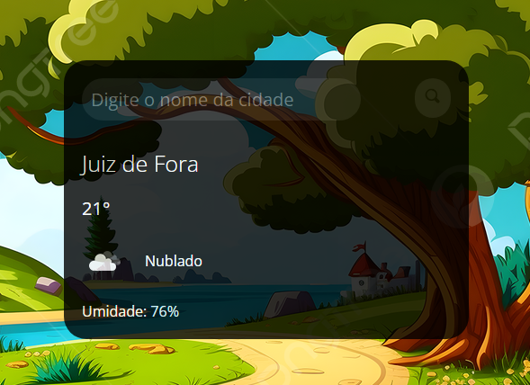

<h1 align="center"> Previsão do Tempo </h1>

Programa exclusivo e gratuito.  
<a href="https://www.linkedin.com/in/andr%C3%A9-s-rolim-b8271b207/" target="_blank" >Conheça mais sobre esse e outros projetos clicando aqui.</a>

  <a href="#-tecnologias">Tecnologias</a>&nbsp;&nbsp;&nbsp;|&nbsp;&nbsp;&nbsp;
  <a href="#-projeto">Projeto</a>&nbsp;&nbsp;&nbsp;

 

  

## 🚀 Tecnologias

Esse projeto foi desenvolvido com as seguintes tecnologias:

- HTML e CSS
- JavaScript
- Git e Github(Versionamento e Deploy)

## 💻 Projeto

O Previsão do Tempo é um projeto que visa buscar a previsão do tempo de acordo com a localização escolhida pelo usuário bastando apenas digitar o nome da cidade.

- [Acesse o projeto finalizado, online](https://andrerollim.github.io/Previsao-do-tempo/)

---

Feito com ♥ by André Rolim :wave:

&nbsp;&nbsp;&nbsp;
&nbsp;&nbsp;&nbsp;

